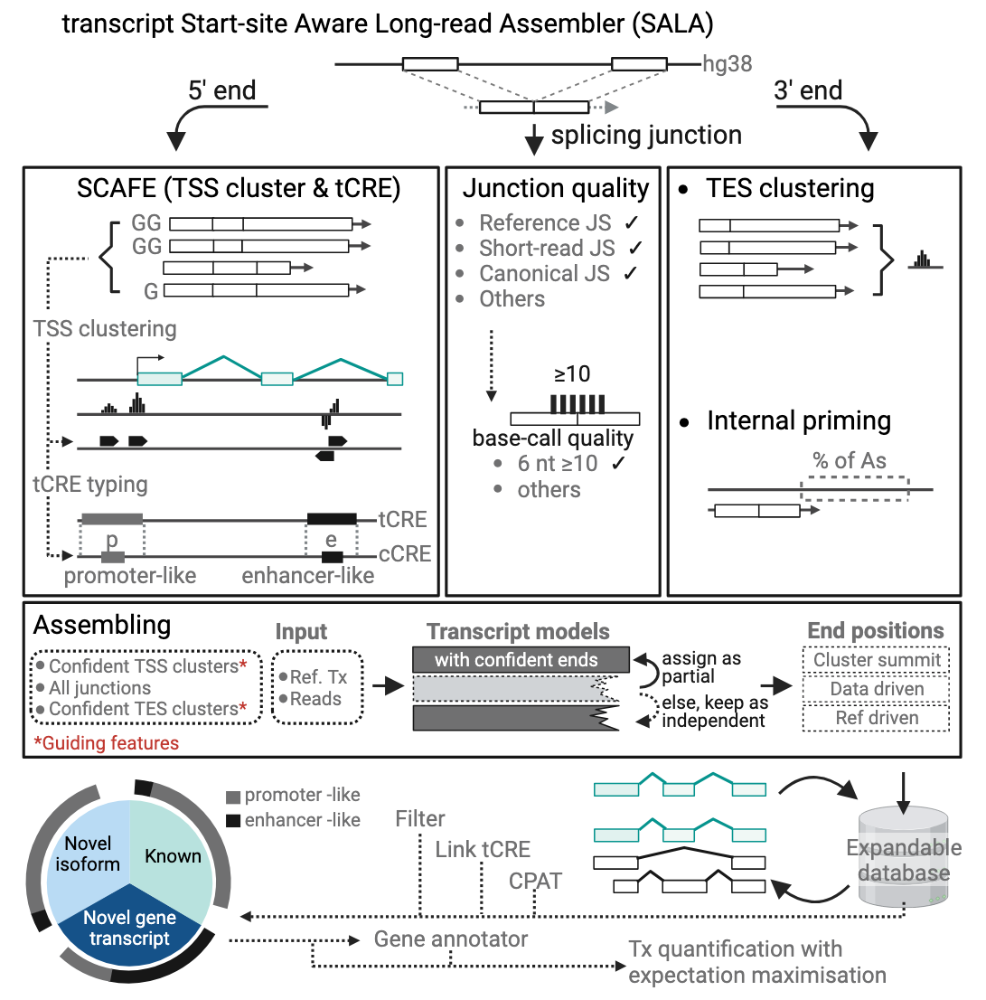

# SALA
<div style="text-align:center"></div>

The transcript Start-site Aware Long-read Assembler (SALA) is developed for de novo assembling long-read into transcript and gene models, considering support from confident transcription start site. SALA incorporates confident TSS clusters de novo identified from the long-read data or pre-defined confident TSS clusters.

## Table of contents
* [Installation](#installation)
* [Running SALA](#how_to_run)
  * [Assembling into transcript models](#transcript_model)
  * [Grouping into initial gene models](#gene_group)
  * [Count matrix per transcript model](#transcript_count)
  * [Annotating the transcript model](#transcript_filter)
  * [Getting final gene model](#final_gene_model)
  * [Final log table and gtf output](#final_table_gtf)
* [Working with the SALA results](#SALA_result)
* [Citing SALA](#SALA_cite)
* [Contribution](#contribution)


# <a name="installation"></a>Installation
To obtain SALA:
```
#--- make a directory to install SALA
mkdir -pm 755 /my/path/to/install/
cd /my/path/to/install/

#--- Obtain SALA from github
git clone https://github.com/fantom-prj/SALA
cd SALA

#--- export SALA scripts dir to PATH for system-wide call of SCAFE commands 
echo "export PATH=\$PATH:$(pwd)/code/SCAFEv1.0.1/scripts" >>~/.bashrc
echo "export PATH=\$PATH:$(pwd)/code/SALA" >>~/.bashrc
echo "export PATH=\$PATH:$(pwd)/code/others" >>~/.bashrc
source ~/.bashrc

#--- making sure the scripts and binaries are executable
chmod 755 -R ./code/
chmod 755 -R ./resources/bin/
```

This package itself does not require installation. Essential binary files for Linux platform are included in ./resources/bin (for SALA) and ./code/SCAFEv1.0.1/resources (for SCAFE). If other platform is used, the binary files need to be replaced by the ones from your system. Alternative bin set for Mac OS can be downloaded here.

# <a name="how_to_run"></a>How to run
## <a name="transcript_model"></a>Assembling into transcript models
This tool assigns long-read sequencing data (as query) to a set of reference transcripts (e.g. GENCODE) using a 5' end centric approach. It will take a set of user-defined of confident 5' end clusters (or de novo defined by clustering) and 3' end clusters (or de novo defined by clustering) and assign the query reads to the reference transcripts with the following step:
1. A query read is classified as complete if both of its 5' and 3' end overlap a confident 5' and 3' end cluster, otherwise as incomplete.
2. An incomplete read without a confident 5' cluster will be flagged.
3. A complete query read will be assigned to a reference transcript if it shares the same 1) 5' end cluster, 2) 3' end cluster and 3) internal splicing structures (i.e. same splicing junctions or both unspliced).
4. An incomplete query read will be assigned to a reference transcript if it shares the same 5'end cluster and a partial internal splicing structure (i.e. contains part if the reference transcript splicing junctions or unspliced but overlap with reference transcript 1st exon).
5. All unassigned query reads will be flagged as novel.
6. Novel complete query reads with the same 1) 5'end cluster, 2) 3'end cluster and 3) internal splicing structure (i.e. same splicing junctions or both unspliced) will be collapsed as a novel transcript model will new ID assigned.
7. Novel incomplete query reads will be assigned to the novel transcript models if it shares the same 5'end cluster and a partial internal splicing structure (i.e. contains part of the reference transcript splicing junctions or unspliced but overlap with novel transcript models 1st exon).
8. All remaining unassigned novel incomplete query reads will be grouped by their 1) 5'end clusters and 2) internal splicing structure (i.e. same splicing junctions or unspliced) and each group will be collapsed as a novel transcript model with a new ID.
9. The 5' end all transcript models will be adjusted to the summit of the 5'end clusters (de novo or user defined).
10. The 3' end complete transcript models will be adjusted to the summit of the 3'end clusters (de novo or user defined).
11. The 3' end incomplete transcript models will be adjusted to the furthest 3'end of its query reads.

```
Usage: end5_guided_assembler_v1.1.pl [options] --qry_bed_bgz --ref_bed_bgz --out_dir
   
   --qry_bed_bgz                <required> [path]    bed 12 of the ONT CAGE reads, 4th column must be read ID and in bgz format, 
                                                     for multiple query bed, user can supply a list of path in plain text format, one line one path
   --ref_bed_bgz                <required> [path]    bed 12 of the reference transcript models, 4th column must be transcript ID and in bgz format
   --out_dir                    <required> [path]    output directory
   --chrom_size_path            <required> [path]    a txt file contains the chromsome size in format of chrom\tsize
   --chrom_fasta_path           <required> [path]    genome fasta file
   --conf_end5_bed_bgz          <required> [path]    a bed bgz 12 file contains the 5'end clusters, summit must be provide in the thick end column
   --conf_end3_bed_bgz          <required> [path]    a bed bgz 12 file contains the 3'end clusters, summit must be provide in the thick end column
   --signal_end5_bed_bgz        <required> [path]    a single nucleotide piled up end5 signal bed (ctss bed file) used to define conf_end5_bed_bgz
   --signal_end3_bed_bgz        <required> [path]    a single nucleotide piled up end3 signal bed (ctes bed file) used to define conf_end3_bed_bgz
   --out_prefix                 (optional) [string]  output files prefix, if not defined, qry_bed_bgz filename will be used
   --novel_model_prefix         (optional) [string]  prefix of the novel transcript models [default=ONTC]
   --min_qry_score              (optional) [integer] the minimum score in the query bed file (assumes MAPQ) to be taken for assembly [default=10]
   --conf_end3_merge_flank      (optional) [integer] the flanking distance (on each side) of the 3'end clusters used to merge as a end3 region.
                                                     Use '-1' to turn off. [default=50]
   --conf_end5_merge_flank      (optional) [integer] the flanking distance (on each side) of the 5'end clusters used to merge as a end5 region.
                                                     Use '-1' to turn off. [default=50]
   --conf_end3_add_ref          (optional) [yes/no]  to add reference 3'end into the user defined confident 3'end clusters or not. if yes, the ref 3'end 
                                                     will bed extended by conf_end3_merge_flank nt and merged with confident 3'end clusters
   --min_exon_length            (optional) [integer] minimum length of an exon in a transcript to be considered as valid. If a transcript contains
                                                     an exon shorter than min_exon_length, the transcript will be discarded [default=1]
   --min_transcript_length      (optional) [integer] minimum length of a transcript (including intron) to be considered as valid. If a transcript 
                                                     is shorter than min_transcript_length, the transcript will be discarded [default=50]
   --filter_conf_end5           (optional) [yes/no]  to filter out query reads that is out the original ranges in the conf_end5_bed_bgz
                                                     will bed extended by conf_end3_merge_flank nt and merged with confident 3'end clusters
   --trnscpt_set_end_priority   (optional) [string]  Priority of methods to determine the ends of transcript set? 
                                                     1) based on "summit" : the signal summit in confident end3/end5 clusters, in signal_end*_bed_bgz
                                                     2) based on "commonest" : the observed position that is the most frequent in transcripts of the set
                                                     3) based on "longest": the observed position that is the furtherest in transcripts of the set
                                                     for (1) and (2), there is chances of causing conflicts in the transcript set ranges (e.g. 3'end is
                                                     more downstream than the 5'end in the transcript set). (3) is guranteed to be conflict free.
                                                     use a colon (:) delimited string to indiciate priority e.g. "summit:commonest:longest"
                                                     [default=summit:commonest:longest]
   --enforce_qry_original_end   (optional) [yes/no]  Overrides 
   --print_trnscrptID           (optional) [yes/no]  Print out the transcript ID or not 
   --doubtful_end_merge_dist    (optional) [integer] Distance to merge incomplete ends as groups [default=100]
   --doubtful_end_avoid_summit  (optional) [yes/no]  Overrides --trnscpt_set_end_priority from using "summit" 
   --retain_no_qry_ref_bound_set(optional) [yes/no]  report the bound set or not if the bound set is not detected from the query reads
   --min_summit_dist_split      (optional) [integer] When splitting an end cluster into two, the minimum distance between two summits [default=50]
   --min_size_split             (optional) [integer] When splitting an end cluster into two, the minimum size of the cluster [default=100]
   --min_frac_split             (optional) [integer] When splitting an end cluster into two, the minimum fraction of signal from the two summits [default=0.2]
   --max_thread                 (optional) [integer] number of threads to be used [default=5]
   --bedtools_bin               (optional) [path]    path to the binary of bedtools, if not provided, "bedtools" will be called
   --tabix_bin                  (optional) [path]    path to the binary of tabix, if not provided, "tabix" will be called
   --bgzip_bin                  (optional) [path]    path to the binary of bgzip, if not provided, "bgzip" will be called

```
## <a name="gene_group"></a>Grouping into initial gene models
This tool annotates the 5'end-guided assembler models as genes. The following script uses the parameter --disable_ref_chain_bound_gene_anno=yes, which prevents recursive gene region extension when unfiltered transcriptional noise is present in the permissive transcript model output. At this stage, the tool assigns preliminary Gene IDs to all transcript models, which will be used in the filtering step.

```
Usage: assemble_gene_annotator_v0.1.pl [options] --qry_bed_bgz --ref_bed_bgz --out_dir
   
    --model_bed_bgz             <required> [path]    generated by end5_guided_assembler, contain info for all reference transcripts
    --model_info_gz             <required> [path]    generated by end5_guided_assembler, contain info for all reference transcripts
    --ref_model_gene_link       <required> [path]    transcript ID to gene ID link of reference transcriptome, columns 1-5: transcript_id, gene_id, transcript_type, gene_type, gene_name
    --out_dir                   <required> [path]    output directory
    --revert_ref_model_bed_bgz  (optional) [path]    if input, will revert the model without qry support back to the bounds in the revert_ref_model_bed_bgz bed input
    --out_prefix                (optional) [string]  output files prefix, if not defined, qry_bed_bgz filename will be used
    --novel_gene_prefix         (optional) [string]  prefix of the novel gene models [default=ONTC]
    --max_thread                (optional) [integer] number of threads to be used [default=5]
    --bedtools_bin              (optional) [path]    path to the binary of bedtools, if not provided, "bedtools" will be called
    --tabix_bin                 (optional) [path]    path to the binary of tabix, if not provided, "tabix" will be called
    --bgzip_bin                 (optional) [path]    path to the binary of bgzip, if not provided, "bgzip" will be called
```

## <a name="transcript_count"></a>Count matrix per transcript model
This tool parse the information from end5_guided_assembler to generate a count matrix per library across all transcript models.

```
Usage: Rscript SALA.count_matrix.R <SALA_directory> <output_directory> <ref.transcriptome_path>
```

## <a name="transcript_filter"></a>Annotating the transcript model
This step intersects reference transcript models’ 3' ends with SALA 3' end clusters, reference 5' ends with SALA 5' end clusters, and SCAFE-defined confident 5' end clusters with SALA 5' end clusters. It also annotates the promoter types of SCAFE tCREs by intersecting them with GENCODE SCREEN cCREs (The ENCODE Project Consortium et al. 2020) and converts SALA transcripts into an exon BED file. Additionally, an optional coding potential analysis using CPAT (Wang et al. 2013) will be performed if a directory for storing CPAT results is provided. CPAT must be installed separately before running this script and can be obtained from: https://github.com/liguowang/cpat. The script gathers all collected information into both a raw log table and a filtered log table. This step requires R and several R packages, including "Biostrings", "GenomicRanges", "Rsamtools", "data.table", "dplyr", "magrittr", and "tidyr". If these packages are not available, the script will attempt to install them automatically. If installation fails, manual installation will be required.

Overall, this step will do the followings:
1. Intersect 5’ ends and 3’ ends from reference transcript model to SALA 5’ end and 3’ end clusters
2. Intersect ENCODE defined promoter-type to SCAFE confident tCREs
3. Internal priming prediction, and filtering of internal primed novel transcript models
4. Add initial gene ID  
5. Incorporate full read count per transcript model
6. Add transcript length and exon number
7. Annotate 3’ end clusters
8. Annotate 5’ end clusters
9. Define promoter-type per transcript model
10. If CPAT path is provided, CPAT coding potential prediction is performed and incorporate into the output table
11. Export raw table with above details
12. Filter to final table according to the parameters input, and export

```
Usage: Rscript SALA.filter.R <SALA_directory> <out_prefix> <resource_directory> <ref_directory> <fasta_file> <read.per.rep_ref.novel.Tx> <read.per.rep_non-ref.novel.Tx> <isoform_ratio> <require.5'.confidence> <SALA_gene_path> <sample_file> <SCAFE_directory> <CPAT_path(optional)>

	SALA_directory                <required>	path of the folder of SALA transcript annotation output
	out_prefix                    <required>	output files prefix
	resource_directory            <required>	path of the resources folder of SALA
	ref_directory                 <required>	path of the folder containing the infomation of reference transcriptome
	fasta_file                    <required>	genome fasta file
	read.per.rep_ref.novel.Tx     <required>	number of reads per replicate from a sample for novel isoform of known gene
	read.per.rep_non-ref.novel.Tx <required>	number of reads per replicate from a sample for novel transcript of novel gene
	isoform_ratio                 <required>	the ratio of a novel isoform across all the transcript in a gene, according to the full length read count
	require.5'.confidence         <required>	if Yes, all the novel transcripts are required to have their 5’ ends located inside confident TSS clusters
	SALA_gene_path                <required>	path of the folder of SALA gene annotation output
	sample_file                   <required>	txt file for the input library: column1, library prefix; column2, sample ID, column3, sampleID with replicate ID
	SCAFE_directory               <required>	path of the folder of SCAFE output
	CPAT_path                     <optional>	path of the folder expected for CPAT result
```

## <a name="final_gene_model"></a>Getting final gene model
In the final gene annotation step, after applying custom filtering, gene annotation should be performed with “--disable_ref_chain_bound_gene_anno=no” to allow proper gene boundary refinement.


## <a name="final_table_gtf"></a>Final log table and gtf output
This script updates the filtered transcript models with the finalized gene annotation from the previous section. It extracts the transcript class and gene class from the reference transcriptome and annotates novel transcript and gene classes if CPAT coding potential results were provided previously. Finally, it generates two GTF files from the filtered transcript models: (1) table4.All_Ref.gtf.gz, which includes filtered novel transcripts and genes along with all transcripts and genes from the reference transcriptome, and (2) table4.Detected_Ref.gtf.gz, which includes filtered novel transcripts and genes along with only the detected transcripts and genes from the reference transcriptome.

```
Usage: Rscript SALA.gene_gtf_annotation.R <SALA_directory> <out_prefix> <resource_directory> <ref_directory> <SALA_gene_path>

	SALA_directory         <required>	path of the folder of SALA transcript annotation output
	out_prefix             <required>	output files prefix
	resource_directory     <required>	path of the resources folder of SALA
	ref_directory          <required>	path of the folder containing the infomation of reference transcriptome
	SALA_gene_path         <required>	path of the folder of SALA final gene annotation output
```

# <a name="SALA_result"></a>Working with the SALA results
Major output from SALA include the log tables for each transcript model and their annotation, and GTF files including the final novel transcripts. 

Column description of the log table:
```
column          final   if      description
                table   CPAT
                only    run
model_ID                        transcript model ID, use ENST if match with ENST
loc                             coordinate of the transcript region
completeness                    Y if both end5_conf & 3end_conf are confident
full_set_ID                     set ID of this model (intermediate info during assembling)
end5_conf                       end5 clusters derived from SCAFE or GENCODE are considered confident
end3_conf                       end3 clusters derived from paraclu (min. read per cluster > 10) or GENCODE are considered confident
junct_conf                      model contain any junctions without support is considered non-confident (junction support: any GENCODE junction, any defined short-read junction, any canonical junction, junction having all +/- 3 basepair basecalling score >10 (use max if more than one read))
end5_endtype                    position inside a 5end cluster is used as the model 5' end: S: summit; C: commonest; L: most upstream
end3_endtype                    position inside a 3end cluster is used as the model 3' end: S: summit; C: commonest; L: most downstream
novelty                         transcript model is new or from reference transcriptome
strand                          strand of the transcript model
partial_set_count               number of partial set that are collapsed into this model
partial_set_ID_str              all the partial sets that are assigned to this model
full_ref_count                  number of transcript model from GENCODE that are completely match with this model
full_qry_count                  number of ONT-CAGE reads that are completely match with this model
partial_ref_count               number of transcript model from GENCODE that are partially match with this model
partial_qry_count               number of ONT-CAGE reads that are partially match with this model
full_set_bound_str              set string of this model (intermediate info during assembling)
IN1_gene_ID                     intermediate Gene ID for grouping of transcript model; same gene if match for least one of feature: 5end cluster, 3end cluster, any junction
IN1_gene_name                   intermediate gene name, use gene name of reference transcriptome
gene_novelty                    gene model is new or from reference transcriptome: Novel / Ref
transcript_novelty              transcript model is new or from reference transcriptome: Novel / Ref
iPSC_rep1                       number of reads with full-length match with this model
iPSC_rep2                       number of reads with full-length match with this model
NSC_rep1                        number of reads with full-length match with this model
NSC_rep2                        number of reads with full-length match with this model
Neuron_rep1                     number of reads with full-length match with this model
Neuron_rep2                     number of reads with full-length match with this model
iPSC                            number of reads with full-length match with this model; sum of the provided replicates
NSC                             number of reads with full-length match with this model; sum of the provided replicates
Neuron                          number of reads with full-length match with this model; sum of the provided replicates
isoform_filter                  permissive or standard, according to the read count filter per replicate for novel isoform of reference genes
novel_gene_Tx_filter            permissive or standard, according to the read count filter per replicate for novel transcript of novel genes
ref_source                      "non_detectable_ref", "fulllength_ref", "partial_ref" or "novel_transcript"
Tx_ratio_iPSC                   transcript ratio of gene (IN1_gene), only consider full-length count
Tx_ratio_NSC                    transcript ratio of gene (IN1_gene), only consider full-length count
Tx_ratio_Neuron                 transcript ratio of gene (IN1_gene), only consider full-length count
max_T_ratio                     maximum transcript ratio of all the samples
n_exon                          number of exon 
transcript_length               transcript length (exclude intron)
n3_string                       ID of end3 cluster
internal_priming                Yes if transcript model 3' end hit internal priming site 
n3_Reference                    Yes if end3 cluster intersect with any Reference 3' end
n3_support                      a collection of support by Reference 3' end, end3 cluster is confident; labeled as internal priming if the 3'end of transcript model hit internal priming site but not a Reference annotated 3' end
n5_string                       ID of end5 cluster
TSScluster                      the SCAFE defined TSS cluster linked to the end5 cluster
CREID                           the ID of the tCRE linked to the TSS cluster
promoter_type                   promoter-like, enhancer-like, CFCT-alone or unclassed defined from SCREEN
n5_Reference                    Yes if end5 cluster intersect with any Reference 5' end
n5_support                      a collection of support by Reference 5' end and SCAFE cluster
ORF                         1   length of the best ORF by CPAT
Coding_prob                 1   coding probability of the best ORF by CPAT, 0 if no ORF was found
CPAT_class                  1   coding or non-coding, cutoff: Coding_prob < 0.364
T4_gene_ID              1       final gene ID according to table 4 transcript model
T4_gene_name            1       final gene name according to table 4 transcript model
T4_gene_novelty         1       updated gene novelty
Ref_transcriptClass     1       transcript class inherited from Reference (NA for novel transcript)
Ref_transcriptClass2    1       simplified transcript gene class showing only "protein_coding", "lncRNA" and "others" (NA for novel transcript)
Ref_geneClass           1       gene class inherited from Reference (NA for novel gene)
Ref_geneClass2          1       simplified gene class showing only "protein_coding", "lncRNA" and "others" (NA for novel gene)  
Novel_transcriptClass   1   1   class for novel transcript: "lncRNA"(>200bp), "ncRNA"(<=200bp) and "others" (potentially coding by CPAT)
overall_T_ratio         1   1   ratio of transcript model per gene, according to full-length count (pan-cell-types)
Novel_geneClass         1   1   class for novel gene: "lncRNA"(>50% weighed number of transcript is grouped as non-coding & weighed average transcript length >200bp), "ncRNA"(>50% weighed number of transcript is grouped as non-coding & weighed average transcript length <=200bp) and "others"
Ref_gene_adjust         1       if the 5' and 3' ends of Reference gene are adjusted 
Ref_transcript_adjust   1       if the 5' and 3' ends of Reference transcript are adjusted 
```

# <a name="SALA_cite"></a>Citing SALA
Please cite our preprint when using SALA:  

*CFC-seq: identification of full-length capped RNAs unveil enhancer-derived transcription.*
Chi Wai Yip, Callum Parr, Hazuki Takahashi, Kayoko Yasuzawa, Matthew Valentine, Hiromi Nishiyori-Sueki, Camilla Ugolini, Valeria Ranzani, Mitsuyoshi Murata, Masaki Kato, Wenjing Kang, Wing Hin Yip, Youtaro Shibayama, Andre Darah Sim, Ying Chen, Xufeng Shu, Jonathan Moody, Ramzan Umarov, Manli Yang, Jen-Chien Chang, Luca Pandolfini, Tsugumi Kawashima, Michihira Tagami, Tomoe Nobusada, Tsukasa Kouno, Carlos Alfonso Gonzale, Roberto Albanese, Francesco Dossena, Nejc Haberman, Kokoro Ozaki, Takeya Kasukawa, Boris Lenhard, Martin Frith, Beatrice Bodega, Francesco Nicassio, Lorenzo Calviello, Magda Bienko, Ivano Legnini, Valérie Hilgers, Stefano Gustincich, Jonathan Göke, Charles-Henri Lecellier, Jay W. Shin, Chung-Chau Hon, Piero Carninci
bioRxiv; doi: https://doi.org/10.1101/2024.10.31.620483


# <a name="contribution"></a>Contribution
Major contribution for SALA development: 

1. Main: Chung-Chau Hon, Chi Wai Yip
2. Modification of bambu: Andre Darah Sim, Ying Chen, Jonathan Göke
3. Testing SALA: Callum Parr, Camilla Ugolini, Valeria Ranzani 


