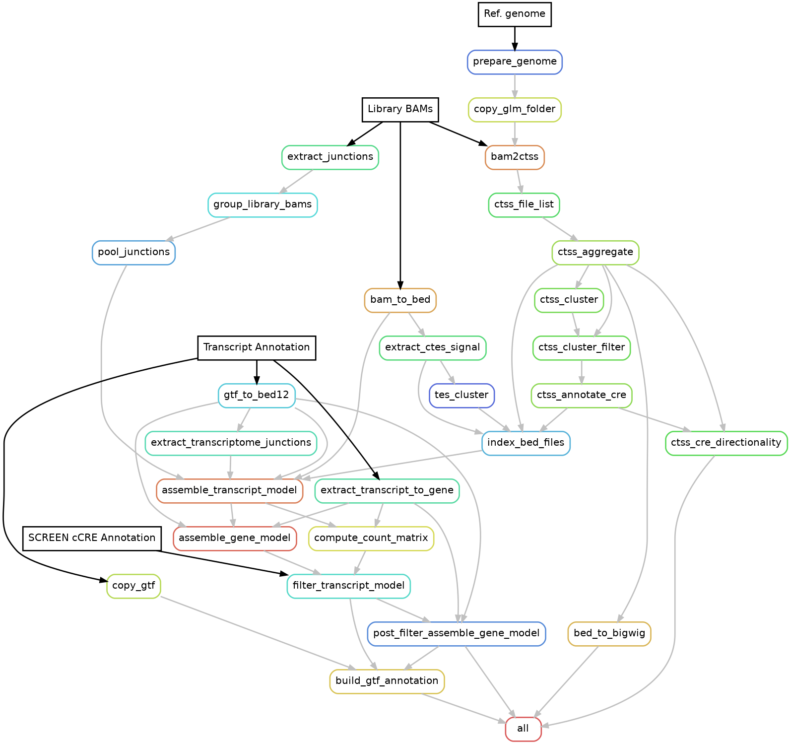

# SALA SLURM-Snakemake workflow

This workflow integrates core steps of SALA in a SLURM-ready snakemake pipeline to assemble a transcript and gene model starting from long-read alignments in BAM format. In particular, it goes through the steps 2, 3 and 4 of the SALA wiki[^sala-wiki]. 
This workflow allows to process independent libraries in parallel, through separated jobs orchestrated by snakemake. For each library, independent sub-jobs can be run in parallel as well. This is also handled by snakemake, depending on the available resources on your cluster.

## Dependencies
The workflow is designed to run on a SLURM-based HPC environment. The only prerequisite is a Conda-compatible package manager[^conda]. We recommend using Conda ≥ 23.0. All required channels and package dependencies are specified in the workflow environment files (see below).

## How to run

### 1. Environment setup
* Make sure SALA scripts are executable
* for snakemake pipeline, go to workflow directory and create snakemake environment with conda
```sh
chmod 755 -R ./code/
cd /your/SALA/directory/workflow
conda env create -f snakemake/environment.yml
```

### 2. Test run
* Activate the snakemake-slurm environment, download fasta / gtf for test run to test/resources
* Run the demo with the name of your slurm partition, you may identify it with sinfo

```sh
cd /your/SALA/directory/workflow/test/resources
wget https://www.encodeproject.org/files/GRCh38_no_alt_analysis_set_GCA_000001405.15/@@download/GRCh38_no_alt_analysis_set_GCA_000001405.15.fasta.gz
gunzip GRCh38_no_alt_analysis_set_GCA_000001405.15.fasta.gz

```

* Update partition name of SLURM [slurm_partition: "cpuq" -> your partition name], you can identify it by sinfo
```sh
nano /your/SALA/directory/workflow/profile/test/config.yaml
```

* The set of configuration files can be found under config/test and profile/test.
* Test results located in test/results
```sh
conda activate snakemake-slurm

cd /your/SALA/directory/workflow

snakemake --executor slurm \
    --snakefile snakemake/Snakefile \
    --workflow-profile profile/test \
    --configfile config/test/config.test.yml \
    --jobs 6 --cores 12 --keep-going \
    --retries 2 --rerun-incomplete
```

### 3. Run your sample 
#### File setup
You may copy the test files and fill the fields according to your resources and data.

* Prepare the library tables (sample_table.csv, replicates.tsv, runs.tsv)
```sh
cp config/test/all_replicates.tsv config/replicates.tsv 
# Edit your replicates.tsv

cp config/test/all_runs.tsv config/runs.tsv 
# Edit your runs.tsv

cp config/test/sample_table_all.csv config/sample_table.csv 
# Edit your sample_table.csv
```

* Set up library 5' confidence and internal priming details in the libraries configuration file (library.config.yml). 
```sh
# In case your libraries are 5' confident
cp config/test/library.config.yml config/library.config.yml

# In case your libraries are not 5' confident
cp config/test/library_notconf.config.yml config/library.config.yml

# Edit your library.config.yml
```

* Set up the configuration file (config.yml)
```sh
cp config/test/config.test.yml config/config.yml
# Edit your config.yml
```

* Update partition name of SLURM [slurm_partition: "cpuq" -> your partition name], you can identify it by sinfo
```sh
nano /your/SALA/directory/workflow/profile/config.yaml
```

* Launch the workflow as follows, by setting appropriate number of jobs and cores depending on your libraries' replicates. We recommend as many jobs as the total number of replicates, and 4 cores per library. Note that these are the max resources that snakemake will be able to allocate as needed by the workflow steps; resources will be optimized to use the minimum number of jobs and cores as possible, depending on the required parallelization.
```sh
conda activate snakemake-slurm
cd /your/SALA/directory/workflow

snakemake --executor slurm \
    --snakefile snakemake/Snakefile \
    --workflow-profile profile \
    --configfile config/config.yml \
    --jobs 12 --cores 16 --keep-going \
    --retries 2 --rerun-incomplete
```

## Configuration

### General config

The configuration files needed for the workflow are found in the config folder. the ```config.yaml``` file is the entrypoint for all information regarding the location of input, results, library configuration and parameters. 

```yaml
samplesheet: config/test/sample_table_all.csv [Path of the library table (see below), *need update]
results_dir: test/results [Path to the folder where results will be stored, *need update]
reference_dir: test/reference [Path where processed files from reference annotation will be stored, *need update]
logs_dir: test/logs [Path to the folder where logs will be stored, *need update]
fasta_genome: test/resources/GRCh38_no_alt_analysis_set_GCA_000001405.15.fasta [Path of the reference genome (.fasta). It needs to be unzipped and the same the BAM reads are aligned to]
mask_bed: test/resources/GRCh38-cCREs.sorted.bed [For SCAFE alone Path of the promoter/enhancer annotation on the reference genome (.bed)]
gtf_annotation: test/resources/gencode.v47.annotation.gtf.gz [Path of the reference transcriptome annotation (.gtf.gz)]
genome_anno_id: hg38_gencode47 [Id for the genome+annotation folder (for SCAFE and SALA internal usage)]
genome_code: hg38 [Code name for the genome (for SALA internal usage)]
library_config: config/test/library.config.yml [Path of the library configuration file (see below), *need update]
params_set_file: config/params.csv [Path of the parameters set file]
params_set: default [Choice of parameters set (must be column in params_set_file), can be customized by adding column in config/params.csv]
```

The ```params.csv``` file contains pre-defined parameters set (default and sensitive) for the various steps of the workflow. To define your own set of parameters, it is possible to add an additional column to the csv, and to change the parameters set choice accordingly in the config.yml.
```
bamtoctss_TSS_mode[softclip] Softclip or first_match. if 'softclip', TSS will be determined by 
                                                    softclip postiion, if 'first_match', TSS will be determined by 
                                                    the first nt that match to genome.
bamtoctss_unencoded_G_upstrm_nt[3] The number of nucleotide used to cound the nunber of 
                                                    unencoded G, if set to 2, the maximum number of unencoded
                                                    G in a read will be 2 (default=2)
                                                    softclip postiion, if 'first_match', TSS will be determined by 
bamtoctss_max_softclip_length[3] Maximum length of allowed softclip at 5'end of the read to be
                                                    considered as valid (default=10)
                                                    softclip postiion, if 'first_match', TSS will be determined by 
                                                    the first nt that match to genome. (default=first_match)
ctss_cluster_min_summit_count[0] Minimum submit count of the 5'end cluster to be considered as confident
ctss_cluster_min_cluster_count[1] Minimum read count of the 5'end cluster to be considered as confident
ctss_annotate_cre_min_cre_count[3] Minimum read count of the tCRE to be considered as confident
tes_cluster_min_summit_count[3] Minimum submit count of the 3'end cluster to be considered as confident
tes_cluster_min_cluster_count[5] Minimum read count of the 3'end cluster to be considered as confident
tes_cluster_min_nt_count[3] Minimum length of the 3'end cluster to be considered as confident
extract_junctions_min_nt_qual[10] The minimum quality score of a base pair to be considered as high quality.
                                                    A junction on a read is considered to be high quality if all its six flanking
                                                    nucleotide (-3,-2,-1 upstream of donor site and 1,2,3 downstream of acceptor site) 
                                                    has quality greater than or equal to min_nt_qual
extract_junctions_min_mapq[20] The minimum MAPQ of the reads to be considered high quality.
assemble_tx_model_min_output_qry_count[1] Output all the transcipt models with at least this number of count.
assemble_tx_model_conf_end3_merge_flank[150] The flanking distance (on each side) of the 3'end clusters used to merge as a end3 region. Use '-1' to turn off.
assemble_tx_model_conf_end5_merge_flank[75] The flanking distance (on each side) of the 5'end clusters used to merge as a end5 region. Use '-1' to turn off.
assemble_tx_model_conf_end3_add_ref[yes] To add reference 3'end into the user defined confident 3'end clusters or not. if yes, the ref 3'end will bed extended by conf_end3_merge_flank nt and merged with confident 3'end clusters.
assemble_tx_model_conf_end5_add_ref[yes]To add reference 5'end into the user defined confident 5'end clusters or not. if yes, the ref 5'end will bed extended by conf_end5_merge_flank nt and merged with confident 5'end clusters.
assemble_tx_model_min_exon_length[1] Minimum length of an exon in a transcript to be considered as valid. If a transcript contains an exon shorter than min_exon_length, the transcript will be discarded.
assemble_tx_model_min_transcript_length[15] Minimum length of a transcript (including intron) to be considered as valid. If a transcript is shorter than min_transcript_length, the transcript will be discarded.
assemble_tx_model_print_trnscrptID[no] Print out the transcript ID or not 
assemble_tx_model_trnscpt_set_end_priority[summit:commonest:longest] Priority of methods to determine the ends of transcript set? 
                                                     1) based on "summit" : the signal summit in confident end3/end5 clusters, in signal_end*_bed_bgz
                                                     2) based on "commonest" : the observed position that is the most frequent in transcripts of the set
                                                     3) based on "longest": the observed position that is the furtherest in transcripts of the set
                                                     for (1) and (2), there is chances of causing conflicts in the transcript set ranges (e.g. 3'end is
                                                     more downstream than the 5'end in the transcript set). (3) is guranteed to be conflict free.
                                                     use a colon (:) delimited string to indiciate priority e.g. "summit:commonest:longest"
                                                     [default=summit:commonest:longest]
assemble_tx_model_doubtful_end_merge_dist[150] Distance to merge incomplete ends as groups
assemble_tx_model_doubtful_end_avoid_summit[yes] Overrides --trnscpt_set_end_priority from using "summit" 
assemble_tx_model_min_summit_dist_split[50] When splitting an end cluster into two, the minimum distance between two summits
assemble_tx_model_retain_no_qry_ref_bound_set[no] Report the bound set or not if the bound set is not detected from the query reads
assemble_tx_model_min_size_split[100] When splitting an end cluster into two, the minimum size of the cluster
assemble_tx_model_min_frac_split[0.2] When splitting an end cluster into two, the minimum fraction of signal from the two summits
assemble_tx_model_min_qry_score[0] The minimum score in the query bed file (assumes MAPQ) to be taken for assembly
assemble_gene_model_min_ref_exon_overlap_pct[10] Percentage of exon overlap to consider as the same gene
assemble_gene_model_exon_overlap_dist[-1] Minimum exon overlap distance, can be applied together with assemble_gene_model_min_ref_exon_overlap_pct
assemble_gene_model_locus_merge_dist[set as 100000] For dividing the serach window in gene assembling
assemble_gene_model_exclude_t_type[retained_intron] Transcript type that is excluded from gene assembling
filter_tx_model_read_per_rep_ref_novel_tx[integer] Number of full-length read from each replicate for novel isoforms of reference genes
filter_tx_model_read_per_rep_noref_novel_tx[integer] Number of full-length read from each replicate for novel transcripts of novel genes
filter_tx_model_isoform_ratio[0-1] For novel isoforms of reference genes alone, ratio of full-length count of the transcript among all the transcripts in the same gene has to be above this number
filter_tx_model_require_5pr_confidence[Yes/No] if Yes, all novel models without 5' ends support (by confident regions or reference 5' end) will be excluded during filter
filter_tx_model_n3_confid_ref_novel_tx[Yes/No] if Yes, novel isoforms of reference genes without 3' end support (by confident regions or reference 3' end) will be excluded during filter
filter_tx_model_n3_confid_noref_novel_tx[Yes/No] if Yes, novel models of novel genes without 3' end support (by confident regions or reference 3' end) will be excluded during filter
```


The ```profile/config.yml``` file is related to resources configuration. Here it is possible to specify appropriate RAM requirements for the various steps. To handle out of memory issues, by default, the workflow will perform two retries for each step, each time doubling the allocated memory. The mem_mb default values have been defined according to tests on libraries with 60 to 250 million reads. We recommend to change them accordingly to your library size needs.

### Data config
The ```sample_table.csv``` contains the list of all libraries to be processed in parallel, and has to be provided in the sample table specified in the configuration (samplesheet), in this format (header included):
```csv
library_id,bam_list,bam_tc_list,rep_list
neuronset_id,/path/of/neuset/run/file.tsv,/path/of/neuset/run_tc/file.tsv,/path/of/neuset/replicates/file.tsv
thp1_id,/path/of/thp1/run/file.tsv,/path/of/thp1/run_tc/file.tsv,/path/of/thp1/replicates/file.tsv
```
The second column, ```bam_list```, must contain the path of the runs file of the BAMs prior to running TranscriptClean[^tc], that are needed specifically for splicing junctions extraction. The third column, ```bam_tc_list```, can optionally contain a path for the runs file for the splicing-corrected BAMs (if TranscriptClean has been run for the library), or be left empty otherwise. In this case, the run file in bam_list will be used for all the steps. You can refer to the SALA wiki for more details about running TranscriptClean[^sala-wiki-tc] and splicing junction extraction[^sala-wiki-sj].

The granularity of the sample set can be decided according to the user needs. Independent transcript and gene models will be produced for each of the libraries listed in the samplesheet.

For each library in the samplesheet, a replicate file and a run file are needed, both in TSV format.

```replicates.tsv```
The replicate file contains information on how to group the replicates in the library. The format is as follows (header included): 
```tsv
# library_prefix: prefix for the replicate, not containing underscores ("_")
# sample_ID: identifier for a sample in the library
# sample_rep: replicate of the sample
library_prefix	sample_ID	sample_rep
ipsc11	iPSC	iPSC_rep1
ipsc21	iPSC	iPSC_rep2
nsc11	NSC	NSC_rep1
nsc21	NSC	NSC_rep2
neu11	Neuron	Neuron_rep1
neu21	Neuron	Neuron_rep2
```

```runs.tsv```
The run file contains information on where the BAM files are stored, for each replicate in the library defined in the replicates table. It has to be headerless, and contain the following columns:
```tsv
# col1: prefix for the replicate
# col2: identifier for the replicate in the library
# col3: location of the run's alignment BAM file
ipsc11	iPSC_rep1_run1	test/iPSC_rep1_run1_subset.sorted.bam
ipsc21	iPSC_rep2_run1	test/iPSC_rep2_run1_subset.sorted.bam
nsc11	NSC_rep1_run1	test/NSC_rep1_run1_subset.sorted.bam
nsc21	NSC_rep2_run1	test/NSC_rep2_run1_subset.sorted.bam
neu11	Neuron_rep1_run1	test/Neuron_rep1_run1_subset.sorted.bam
neu21	Neuron_rep2_run1	test/Neuron_rep2_run1_subset.sorted.bam
```
As explained in the sample table specification, in case you want to use TranscriptClean BAMs, two run files in this format must be produced: one with the paths of the pre-TranscriptClean BAMs and one with the paths of the post-TranscriptClean BAMs. For more details, refer to the SALA wiki.

```library.config.yml```
In this file, the following information about the libraries have to be specified:
* `internal_priming`: true to remove internal priming affected transcripts due to library preparation (poly-dT priming), false otherwise.
* `5pr_confident`: true if the reads have confident 5' ends, false otherwise. In this latter case, external TSS clusters need to be provided as a .bed.gz file. Pre-set cluster coordinates for human (hg38) and mouse (mm10) can be found in the workflow/resources/CTSS_cluster folder.
* `5pr_cluster`: location of the externally provided TSS clusters file. Mandatory if 5pr_confident is false.

An example of a config file for a not confident 5' library can be found under config/test.
```library_notconf.config.yml
internal_priming: false
5pr_confident: false
5pr_cluster: /your/SALA/directory/resources/CTSS_cluster/hg38_fair+new_CAGE_peaks_phase1and2.bed.bgz
```
5pr_cluster files (Human and mouse TSS regions) are provided in /your/SALA/directory/resources/CTSS_cluster


Specifically for SCAFE prepare genome, besides providing fasta files, cCRE annotation (mask_bed) downloaded from SCREEN should be applied.
SCREEN v3 human and mouse cCRE files were stored in /your/SALA/directory/workflow/test/resources/


[^sala-wiki]: https://github.com/fantom-prj/SALA/wiki
[^tc]: https://github.com/mortazavilab/TranscriptClean
[^sala-wiki-tc]: https://github.com/fantom-prj/SALA/wiki/1.-TranscriptClean
[^sala-wiki-sj]: https://github.com/fantom-prj/SALA/wiki/3.-Features-preparation#34-splicing-junction-collection
[^conda]: https://www.anaconda.com/download
[^gdown]: https://github.com/wkentaro/gdown

## Rule diagram
 <!--TODO generate again -->